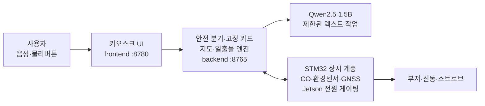

# 2026ESWContest_free_TBD

## 🔖 Intro

묻기 전에 먼저 말해 주는 오프라인 오지 생존 보조 장치, **SafeAid Kit**입니다.

인터넷이 끊긴 산악·오지에서 오프라인 지도와 GPS로 현재 위치와 되돌아갈 길을 잃지 않게 하고,
남은 일조 시간을 계산해 되돌아설 시점을 알려 주며, 사용자가 잠든 동안에도 일산화탄소를 감시합니다.

## 💡 Inspiration

초보자는 정보가 없어서가 아니라 **판단할 시점을 놓쳐서** 위험에 빠집니다.
그래서 이 장치는 사용자가 물어볼 때까지 기다리지 않고, 남은 일조 시간과 트레일 이탈을 먼저 계산해 개입합니다.
그리고 사용자가 스스로 감시하기 어려운 취침 중 환경을 센서가 감시합니다.

## 🚧 구현 상태

SafeAid Kit은 오지 생존 도메인으로 전환 중입니다. 이 페이지는 목표 구조와 안전 경계를 설명하며,
P0 구현 현황은 [PLAN.md](https://github.com/SmartAid-Kit/.github/blob/main/PLAN.md)와 각 저장소 이슈에서 관리합니다.
실제 하드웨어와 통합 검증으로 확인되지 않은 기능을 구현 완료로 주장하지 않습니다.

## 📸 Overview

시스템 구성 이미지는 실제 하드웨어 통합 사진이 준비된 뒤 추가합니다. 아래는 개발 중인 목표 구조입니다.



1. 방위·거리·경로는 지도 엔진이 계산합니다. LLM은 계산하지 않습니다.
2. 생명 관련 질문은 LLM을 거치지 않고 검수된 고정 카드에서 음성으로 직행합니다.
3. 남은 일조 시간을 오프라인 천문 계산으로 구하고, 보행 속도와 비교해 회귀 판단을 돕습니다.
4. STM32 상시 계층이 Jetson 전원을 물리적으로 게이팅하는 이중 전원 구조를 구현합니다.
5. LLM 검증 실패 또는 지연 초과 시 재시도 없이 고정 카드로 전환합니다.

## 👀 Main feature

<details>
<summary><strong>오프라인 지도와 위치 로그 역추적</strong></summary>

사전 다운로드한 벡터 타일 위에 현재 위치를 표시하고 이동 경로를 자동 기록하는 기능을 구현합니다.
트레일 이탈 시 진동과 음성 안내를 제공하고, 지도 엔진이 계산한 복귀 정보를 표시합니다.
측위 정확도와 위성 수를 함께 표시하며, GPS 미수신은 회색으로 유지합니다.

</details>

<details>
<summary><strong>남은 일조 시간 카운트다운</strong></summary>

위도·경도·날짜만으로 일출·일몰·시민박명을 오프라인 계산하고, 최근 보행 속도로 소요 시간을 추정합니다.
여유가 부족하면 적색 경고와 음성 안내를 제공합니다. 이 계산에 LLM은 관여하지 않습니다.

</details>

<details>
<summary><strong>취침 중 일산화탄소 감시</strong></summary>

밀폐된 텐트 안의 연소기구는 수면 중에 초기 증상을 자각할 수 없는 위험입니다.
전기화학식 CO 센서를 STM32 상시 계층에 연결해, **Jetson 전원이 꺼져 있어도** 부저와 진동으로 경보하는 경로를 구현합니다.
경보는 Jetson 부팅을 기다리지 않습니다.

</details>

<details>
<summary><strong>이중 전원 계층</strong></summary>

STM32가 상시 감시하고 Jetson 전원을 MOSFET로 물리 차단하는 구조를 구현합니다.
전력 예산과 운용 가능 기간은 하드웨어 통합 뒤 실측으로 검증합니다.

</details>

<details>
<summary><strong>제한된 LLM과 즉시 폴백</strong></summary>

LLM은 시나리오 분류, 질의 대상 추출, 카드 문장 재구성만 담당합니다.
경로·방위·거리는 출력 스키마에 **숫자 필드 자체가 없어** 환각할 자리가 없습니다.
검증 실패 또는 지연 초과 시 고정 화면으로 전환합니다.

</details>

## Environment

### Embedded

- STM32F401RET6 — 상시 전원 관리자 + 센서 허브 + GNSS 로거
- Air530 GNSS · 전기화학식 CO 센서 · 환경 센서 · RTC
- 배터리·MPPT 충전·Jetson 전원 게이팅

### Backend

- Python
- Jetson Xavier NX
- Python API 서버

### Frontend

- Chromium 단일 kiosk
- 분리형 터치 디스플레이
- 169.5 PPI

### LLM

- Qwen2.5 1.5B Q4_K_M
- llama.cpp
- JSON Schema 제약, `temperature = 0`

## 🗂 Architecture

```text
사용자 (음성 · 물리 버튼 · 터치)
  └─ smartaid-frontend :8780
       └─ smartaid-backend :8765
            ├─ 지도 엔진 · 일출몰 · Zambretti  (전부 로컬 계산)
            ├─ smartaid-embedded → STM32 상시 계층 (CO·환경·GNSS·전원 게이팅)
            └─ smartaid-llm → 제한된 텍스트 처리
```

## File Architecture

```text
SmartAid-Kit/
├─ .github/             조직 프로필과 공통 문서
├─ smartaid-frontend/   7인치 키오스크 UI와 프록시
├─ smartaid-backend/    안전 분기·고정 카드·지도·장치 API
├─ smartaid-embedded/   STM32 상시 계층·센서 허브 펌웨어
└─ smartaid-llm/        하네스·평가·측정
```

| 저장소 | 역할 |
|---|---|
| [smartaid-frontend](https://github.com/SmartAid-Kit/smartaid-frontend) | 키오스크 UI와 backend 프록시 |
| [smartaid-backend](https://github.com/SmartAid-Kit/smartaid-backend) | 안전 분기, 고정 카드, 지도·시간 엔진, 하드웨어 API |
| [smartaid-embedded](https://github.com/SmartAid-Kit/smartaid-embedded) | STM32 상시 전원 관리자·센서 허브 펌웨어 |
| [smartaid-llm](https://github.com/SmartAid-Kit/smartaid-llm) | LLM 하네스, 평가, 기준선 측정 |

## 제3자 라이선스

- 지도 데이터: © OpenStreetMap contributors, ODbL 1.0
- Qwen2.5 1.5B: Apache-2.0
- llama.cpp: MIT
- 프로젝트 자체 LICENSE와 추가 의존성 고지는 공개 전환 전 별도 확정합니다.

## ⚠️ 안전 경계

**SafeAid Kit은 구조 요청 수단이 아닙니다.** 조난 예방과 자력 탈출을 담당하며,
사용자는 별도의 구조 요청 수단(휴대폰, PLB, 위성 통신기)을 반드시 함께 지참해야 합니다.
이 한계는 부팅 시 화면에 표시되며 건너뛸 수 없습니다.

실족·추락은 예방하지 못합니다. 기상 표시는 예보가 아니라 기압 추세 기반 국지 추정이며 항상 `추정` 배지가 붙습니다.
LLM은 경로·방위·거리·처치 절차를 생성하지 않습니다. 야생 동식물의 식용 가능 여부는 어떤 형태로도 판정하지 않습니다.
