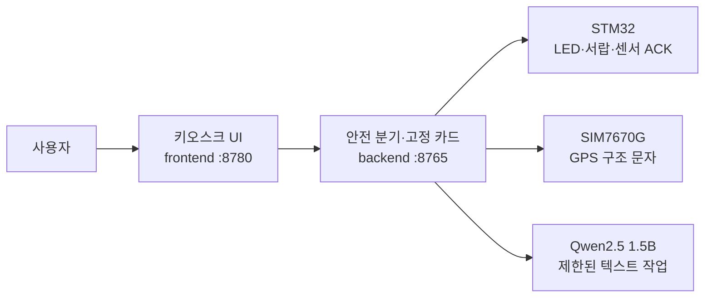

# 2026ESWContest_free_TBD

## 🔖 Intro

말하면 구급함이 물리적으로 응답하는 오프라인 스마트 구급함, **SafeAid Kit**입니다.

인터넷이 끊긴 환경에서도 생명위험을 먼저 확인하고, 검수된 응급처치 카드를 보여 주며, 필요한 구급 물품의 실제 칸을 LED와 서랍으로 안내합니다.

## 💡 Inspiration

통신이 불안정한 산간·재난·야외 환경에서는 검색이나 클라우드 AI에만 의존할 수 없습니다. SafeAid Kit은 응급처치 안내와 GPS 구조 문자 작성을 로컬에서 수행하고, 물품 위치를 화면 설명에 그치지 않고 물리 장치의 반응으로 연결하기 위해 시작했습니다.

## 📸 Overview

시스템 구성 이미지는 실제 하드웨어 통합 사진이 준비된 뒤 추가합니다. 현재 동작 구조는 다음과 같습니다.



1. 의식·정상호흡·대량출혈 3문항을 코드에서 먼저 확인합니다.
2. 생명위험이면 LLM을 기다리지 않고 검수된 고정 카드를 즉시 표시합니다.
3. 필요한 물품의 A~D 칸에 명령을 보내고 센서 ACK를 별도로 확인합니다.
4. GPS 구조 문자를 작성하고 망 제출 상태와 실제 수신 확인을 구분해 표시합니다.
5. LLM 실패 또는 2초 초과 시 재시도 없이 고정 화면으로 전환합니다.

## 👀 Main feature

<details>
<summary><strong>생명위험 우선 분기</strong></summary>

의식·정상호흡·대량출혈 3문항은 LLM보다 먼저 코드가 처리합니다. 사용자에게 보이는 처치 절차는 검수된 고정 카드만 사용합니다.

</details>

<details>
<summary><strong>물품 A~D LED·서랍 ACK</strong></summary>

안내한 구급 물품의 실제 칸을 LED와 서랍 명령으로 연결합니다. 명령을 전송했다는 사실과 센서가 실제 열림을 확인한 상태를 구분하며, ACK 전에는 `열림`으로 표시하지 않습니다.

</details>

<details>
<summary><strong>GPS 구조 문자</strong></summary>

오프라인에서 구조 문자를 작성하고 SIM7670G로 전송합니다. 모뎀의 `OK` 또는 `+CMGS`는 망 제출 결과일 뿐 상대방 수신 확인으로 표시하지 않습니다.

</details>

<details>
<summary><strong>제한된 LLM과 즉시 폴백</strong></summary>

LLM은 시나리오 분류, SMS 필드 추출, 카드 맞춤 문장만 담당합니다. 진단이나 처치 절차를 생성하지 않으며, 검증 실패 또는 2초 초과 시 고정 화면으로 전환합니다.

</details>

## Environment

### Embedded

- STM32F401RET6
- SIM7670G
- 2×2 수납칸 A/B/C/D

### Backend

- Python
- Jetson Xavier NX 8GB
- JetPack 5.1.x

### Frontend

- Chromium 단일 kiosk
- 7인치 1024×600 터치
- 169.5 PPI

### LLM

- Qwen2.5 1.5B Q4_K_M
- llama.cpp
- JSON Schema 제약, `temperature = 0`

## 🗂 Architecture

```text
사용자
  └─ smartaid-frontend :8780
       └─ smartaid-backend :8765
            ├─ smartaid-embedded → STM32 LED·서랍·센서 ACK
            ├─ SIM7670G → GPS 구조 문자
            └─ smartaid-llm → 제한된 텍스트 처리
```

## File Architecture

```text
SmartAid-Kit/
├─ .github/             조직 프로필과 공통 문서
├─ smartaid-frontend/   7인치 키오스크 UI와 프록시
├─ smartaid-backend/    안전 분기·고정 카드·장치 API
├─ smartaid-embedded/   STM32·ESP32 펌웨어
└─ smartaid-llm/        하네스·평가·측정
```

| 저장소 | 역할 |
|---|---|
| [smartaid-frontend](https://github.com/SmartAid-Kit/smartaid-frontend) | 키오스크 UI와 backend 프록시 |
| [smartaid-backend](https://github.com/SmartAid-Kit/smartaid-backend) | 안전 분기, 고정 카드, 하드웨어 API |
| [smartaid-embedded](https://github.com/SmartAid-Kit/smartaid-embedded) | STM32 트레이 컨트롤러와 ESP32 펌웨어 |
| [smartaid-llm](https://github.com/SmartAid-Kit/smartaid-llm) | LLM 하네스, 평가, 기준선 측정 |

## ⚠️ 안전 경계

SafeAid Kit은 의료기기가 아니며 전문 의료진을 대체하지 않습니다. LLM은 사용자에게 보이는 처치 절차를 생성하지 않습니다. 생명위험 분기는 고정 코드가 먼저 처리하며, 모뎀 망 제출과 상대방 수신 확인, 명령 전송과 센서 ACK를 각각 구분합니다.
